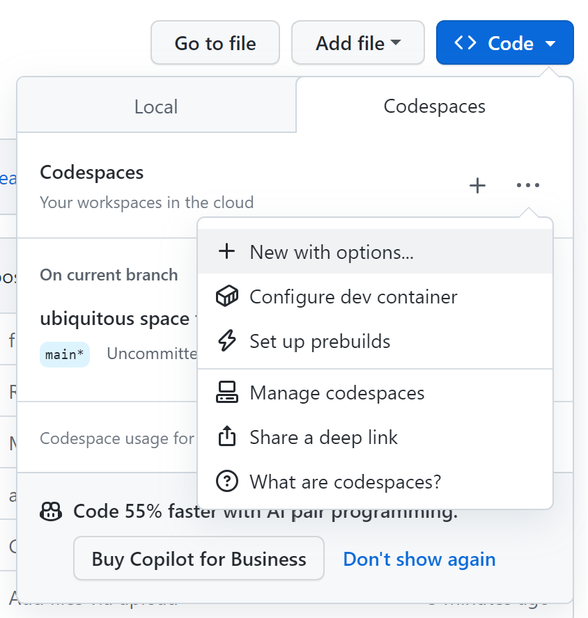
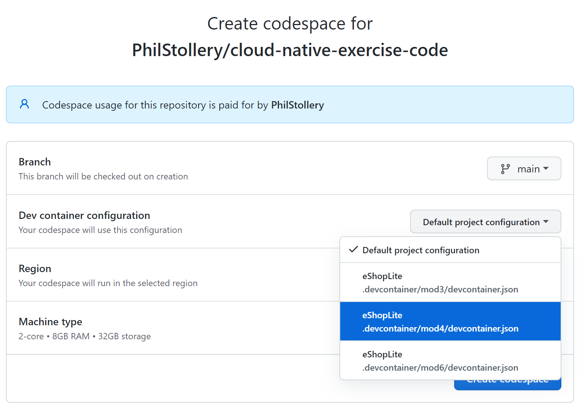

# Microsoft Learn for .NET Cloud Native Development

This repo contains the sample code for all the exercises in the [cloud native learning path for .NET](https://learn.microsoft.com/training/paths/create-microservices-with-dotnet/).

1. Select **Code**.
2. Select the **Codespaces** tab.
   
   
   
4. Select **...** (Codespace respository configuration), then select **+ New with options**.
5. Select the devcontainer for the module you want.
   
   
   